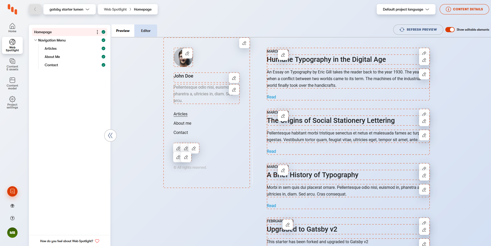

# Nuxt 3 + Kontent by Kentico starter

[](https://raw.githubusercontent.com/ondrabus/nuxt3-starter-kontent-lumen/main/LICENSE)
[](https://stackoverflow.com/tags/kentico-kontent)
[](https://nuxt3-starter-kontent-lumen.netlify.com/)

[](https://app.netlify.com/sites/nuxt3-starter-kontent-lumen/deploys)

Lumen is a minimal, lightweight and mobile-first starter for creating blogs.

**Warning: Nuxt 3 is in beta and is not meant to be used on production. The implementation is still unstable.**


## Features
+ Nuxt 3 as a static site generator
+ TypeScript
+ Content from [Kontent](http://kontent.ai/) headless CMS.
+ [Kontent Delivery JS SDK (^11.0.0)](https://github.com/Kentico/kontent-delivery-sdk-js/tree/vnext) via [Kontent Nuxt3 module](https://github.com/ondrabus/kontent-nuxt3-module)
+ [Kontent Model generator (^4.0.0)](https://github.com/Kentico/kontent-model-generator-js) to automatically generate content types into strongly typed models.
+ Uses [Pinia](https://pinia.esm.dev/) as a data store.
+ [Mobile-First](https://medium.com/@mrmrs_/mobile-first-css-48bc4cc3f60f) approach in development.
+ Stylesheet built using SASS and [BEM](http://getbem.com/naming/)-Style naming.
+ Sidebar menu built using a configuration block.
+ Archive organized by tags and categories.

## Getting Started

### Requirements

+ [Node.js](https://nodejs.org/)

### Create codebase

1. Click on "Use this template" button to [create your own repository from this template](https://help.github.com/en/github/creating-cloning-and-archiving-repositories/creating-a-repository-from-a-template).

### Create content source

1. Go to [app.kontent.ai](https://app.kontent.ai) and [create empty project](https://docs.kontent.ai/tutorials/set-up-kontent/projects/manage-projects#a-creating-projects)
1. Go to "Project Settings", select API keys and copy
    + Project ID
1. Install [Kontent Backup Manager](https://github.com/Kentico/kontent-backup-manager-js) and import data to newly created project from [`kontent-backup.zip`](./kontent-backup.zip) file (place appropriate values for `apiKey` and `projectId` arguments):

    ```sh
    npm i -g @kentico/kontent-backup-manager

    kbm --action=restore --apiKey=<Management API key> --projectId=<Project ID> --zipFilename=kontent-backup
    ```

    > Alternatively, you can use the [Template Manager UI](https://kentico.github.io/kontent-template-manager/import-from-file) for importing the content.

1. Go to your Kontent project and [publish all the imported items](https://docs.kontent.ai/tutorials/write-and-collaborate/publish-your-work/publish-content-items).

### Join codebase and content data

Copy [`.env.template`](`./.env.template`) and name it `.env` then set the `KONTENT_PROJECT_ID` environment variable to value from Kontent -> "Project Settings" ->  API keys -> Project ID.

**You are now ready to use the site as your own!**

## Development

Install the dependencies and run development environment

```sh
npm install  
npm run dev
```

## Site production build

Install the dependencies and run production build

```sh
npm install
npm run build
npm run start
```

## Fully static site

According to [the page in Nuxt 3 docs](https://v3.nuxtjs.org/getting-started/introduction#comparison), the full static mode is not yet supported. The command `nuxt generate` does not currently work.

## Using Kontent plugin in Nuxt 3

This implementation uses [the new JS Delivery SDK for Kontent](https://github.com/Kentico/kontent-delivery-sdk-js/tree/vnext). The deliveryClient is registered via Nuxt 3 plugin and accessible to all pages and components via app context:

```js
const kontent = useNuxtApp().$kontent
```

See the configuration details on the [Kontent Nuxt3 module page](https://github.com/ondrabus/kontent-nuxt3-module).

### Preview Deploy

To allow this example load unpublished content via  [Preview Delivery API](https://docs.kontent.ai/reference/delivery-api#section/Production-vs.-Preview), you need to adjust `.env` file created in ["Join codebase to content data"](#Join-codebase-and-content-data) section by setting the following environment variable:

`KONTENT_PREVIEW_KEY=<PREVIEW_API_KEY>` by passing the [Preview authentication key](https://docs.kontent.ai/reference/delivery-api#section/Authentication)

You also need to adjust the `nuxt.config.ts` which holds the configuration for the `deliveryClient`:

```js
...
publicRuntimeConfig: {
  kontent: {
    projectId: process.env.KONTENT_PROJECT_ID,
    previewApiKey: process.env.KONTENT_PREVIEW_KEY,
    defaultQueryConfig: {
      usePreviewMode: true
  }
}
...
```

#### Preview URLs

Once you've got your app running in a preview environment, you need to specify where (URL-wise) each type of your content can be accessed and viewed. For example, imagine your app runs at https://preview.example.com so you want to open "Project Settings", and select "Preview URLs" set it like this:

+ `Article`: `https://preview.example.com/articles/{URLslug}`
+ `Author`: `https://preview.example.com`
+ `Category`: `https://preview.example.com/categories/{URLslug}`
+ `Menu`: `https://preview.example.com`
+ `Menu Item`: `https://preview.example.com/{URLslug}`
+ `Tag`: `https://preview.example.com/tags/{URLslug}`

## Deploy with Netlify

Netlify can run in any frontend web environment, but the quickest way to try it out is by running it on a pre-configured starter site with Netlify. Use the button below to build and deploy your own copy of the repository:

[](https://app.netlify.com/start/deploy?repository=https://github.com/ondrabus/nuxt3-starter-kontent-lumen)

After clicking that button, you’ll authenticate with GitHub and choose a repository name. Netlify will then automatically create a repository in your GitHub account with a copy of the files from the template. Next, it will build and deploy the new site on Netlify, bringing you to the site dashboard when the build is complete.

Note: The build base directory should be set to `src` and publish directory should be `src/dist`.

## Implementing Web spotlight

This example is ready to be used with [Web Spotlight](https://webspotlight.kontent.ai/) functionality - direct website editing from within the headless CMS.



